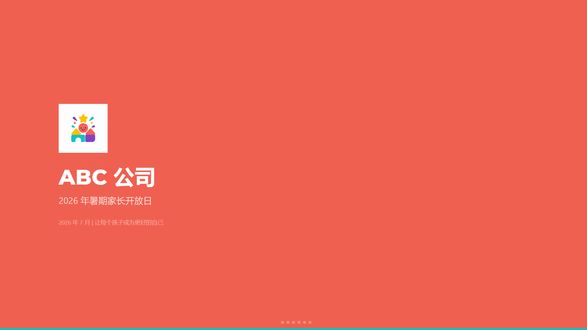
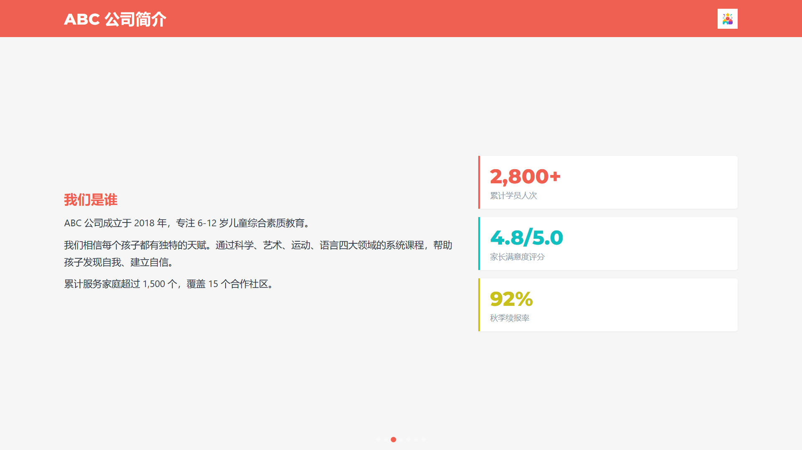
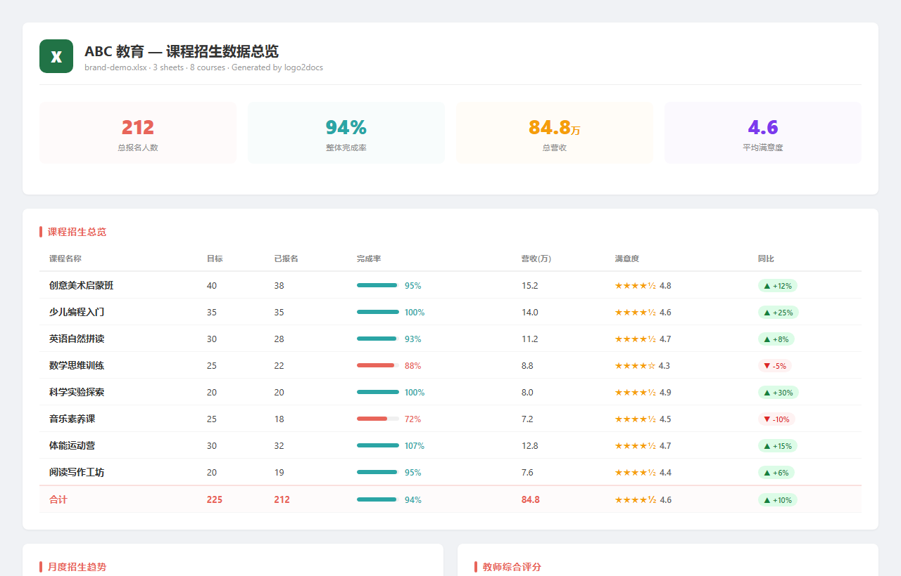
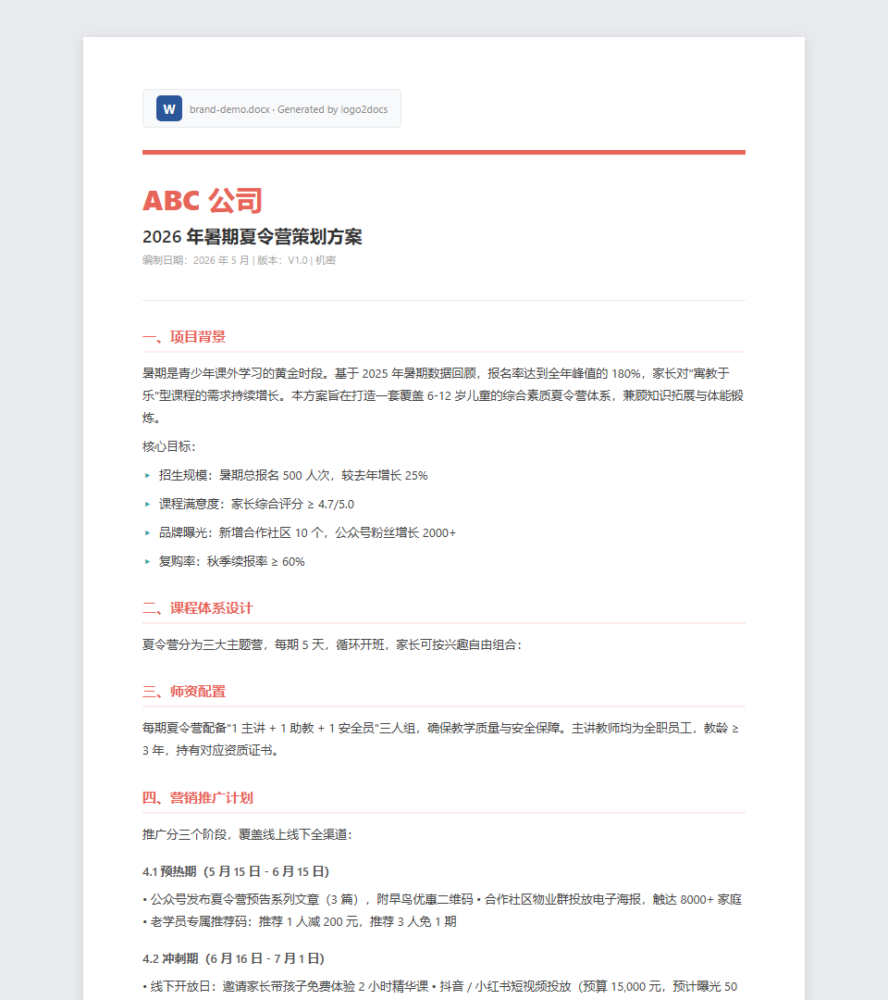
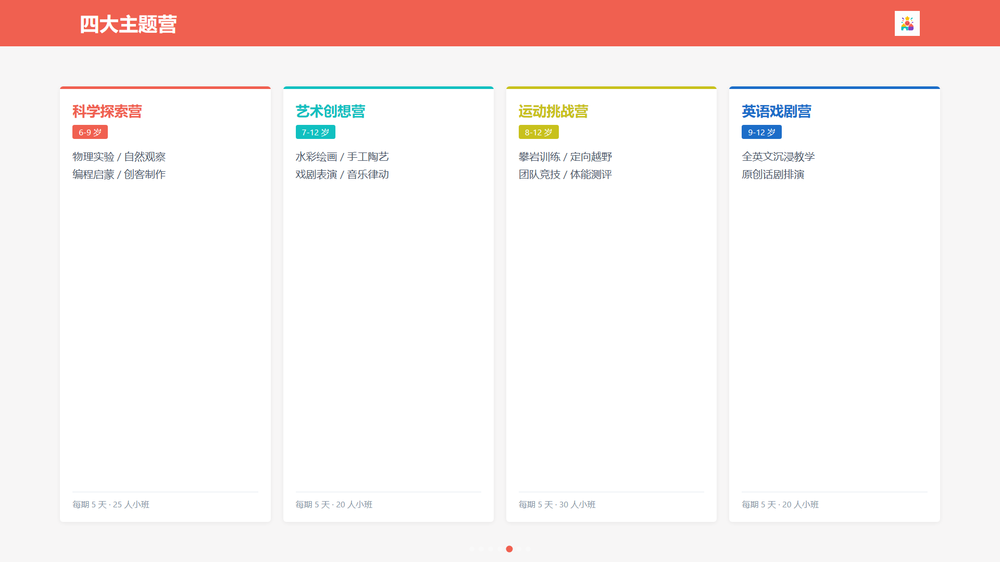
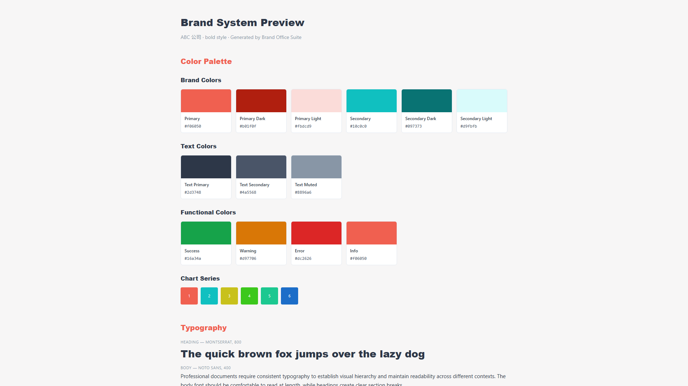
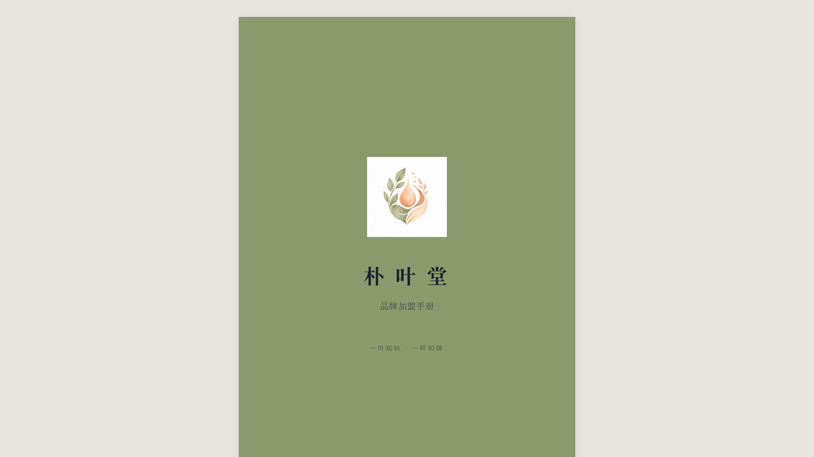
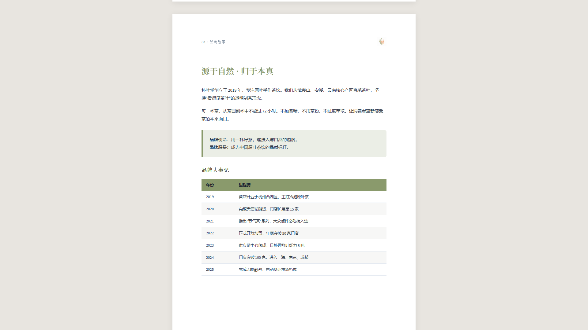
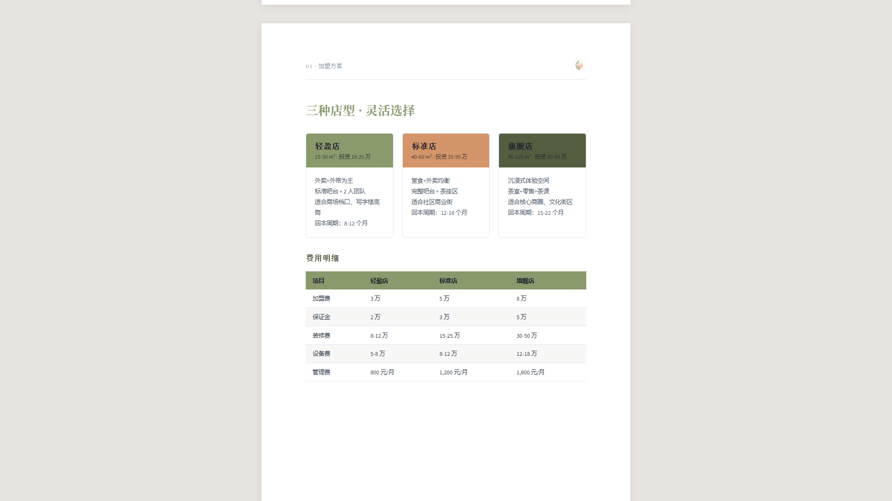
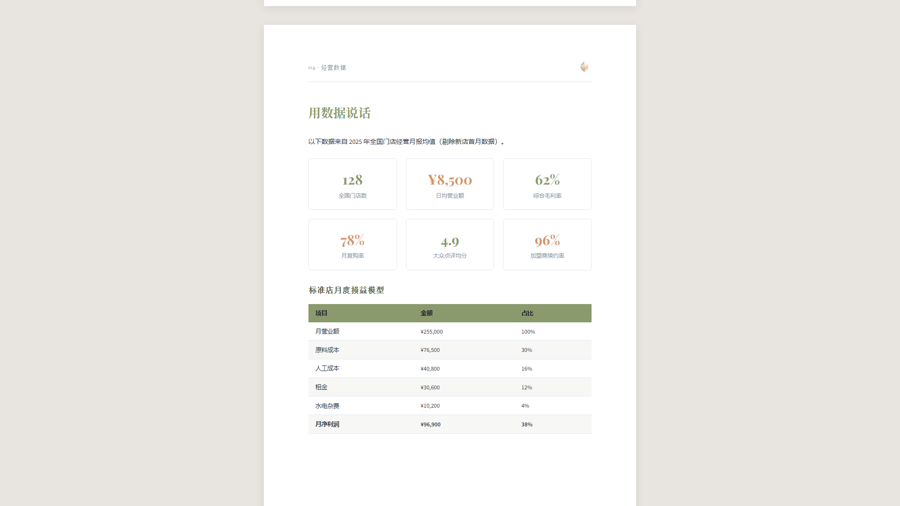

[English](README.md) · [中文](README.zh.md) · [日本語](README.ja.md) · **한국어**

<h1 align="center">logo2docs</h1>

<p align="center">
  <em>「로고 하나로, 브랜드 통일 문서 스위트를 자동 생성.」</em>
</p>

<p align="center">
  <a href="LICENSE"></a>
  <a href="https://skills.sh"></a>
  <a href="#"></a>
</p>

**회사 로고를 업로드하면 브랜드 컬러를 자동 추출하고, 통일된 디자인의 Excel / Word / PowerPoint / HTML 슬라이드 / PDF / 플로차트 / 핸드북을 한 번에 생성합니다.** Figma 불필요, 템플릿 불필요, 디자인 스킬 불필요.

PowerPoint 파일은 진짜 `.pptx` — PowerPoint / Keynote에서 자유롭게 편집 가능. 더 화려한 애니메이션을 원하면 HTML 모드를 선택하세요.

```
npx skills add quzhi-ai/logo2docs
```

---

## 작동 방식

logo2docs는 2단계 시스템입니다:

1. **브랜드 구축** (1회) — 로고에서 컬러 추출 → 3가지 질문 → 완전한 디자인 시스템 `brand-config.json` (40개 이상의 디자인 토큰)
2. **문서 생성** (온디맨드) — brand-config.json 기반으로 모든 문서 유형 생성, 브랜드 스타일 자동 통일

```
로고 업로드 → 컬러 추출 → 3가지 질문 → brand-config.json → 모든 문서 유형
```

### 지원 문서 유형

| 포맷 | 기술 | 출력 |
|------|------|------|
| Excel 스프레드시트 | openpyxl | `.xlsx` |
| Word 문서 | python-docx | `.docx` |
| PowerPoint 프레젠테이션 | python-pptx | `.pptx` |
| HTML 프레젠테이션 | 인라인 HTML/CSS/JS | `.html` |
| PDF | HTML → 브라우저 인쇄 | `.html` / `.pdf` |
| 플로차트 / 다이어그램 | 인라인 SVG | `.html` |
| 핸드북 / 매뉴얼 | A4 페이지 분할 HTML | `.html` / `.pdf` |

> **💡 PowerPoint 파일은 완전히 편집 가능** — PowerPoint / Google Slides / Keynote에서 열어 텍스트 수정, 요소 이동, 슬라이드 추가가 자유자재. 이미지가 아닌 진짜 `.pptx` 파일입니다. 더 화려한 애니메이션을 원하시면 HTML 프레젠테이션 모드를 선택하세요.

## 빠른 시작

### 스킬 설치

```bash
npx skills add https://github.com/quzhi-ai/logo2docs
```

또는 수동: 이 저장소를 클론하고 Claude Code 스킬 디렉토리에 복사하세요.

### 사용법

Claude에게 말하기만 하면 됩니다:

> "이것이 우리 회사 로고입니다. 브랜드 시스템을 구축하고 분기별 보고서를 Excel로 만들어 주세요."

Claude가 자동으로:
1. 로고 컬러 분석
2. 3가지 질문 (업종, 스타일 선호도, 기존 가이드라인)
3. `brand-config.json` — 완전한 디자인 시스템 생성
4. 브랜드 통일된 문서 출력

## 디자인 원칙

### 안티 AI 미학

생성된 문서는 프로 디자이너가 만든 것처럼 보이며, AI가 만든 것처럼 보이지 않습니다:

- 그라데이션 배경 금지 (특히 블루-퍼플 계열)
- 이모지를 장식으로 사용하지 않음
- 둥근 모서리 카드 + 왼쪽 색상 바 금지
- 3D 파이 차트나 가짜 3D 효과 금지
- 의도적인 여백 (40%의 빈 공간은 좋은 디자인)
- 높은 대비, 정밀한 그리드 정렬
- 단색만 사용, 얇은 선 구분자

### 60-30-10 배색 규칙

- **60%** — 뉴트럴 (흰색/밝은 배경, 본문)
- **30%** — 브랜드 주요 색상 (제목, 주요 섹션)
- **10%** — 보조/강조 색상 (하이라이트, 데이터 강조)

## 데모

`demos/` 디렉토리에 2개의 완전한 브랜드 데모가 포함되어 있습니다:

### ABC Education (볼드 스타일)
어린이 교육 기업 — 코럴 레드 + 틸. Excel, Word, PowerPoint, HTML 슬라이드, 플로차트.

<p align="center">
 <br>
 <br>
 
</p>

### 朴叶堂 (엘레강트 스타일)
프리미엄 웰니스 차 브랜드 — 올리브 그린 + 웜 애프리콧. PowerPoint, HTML 핸드북 (A4 8페이지).

<p align="center">
 <br>
 
</p>

## 프로젝트 지원

logo2docs가 도움이 되셨다면, 커피 한 잔 사주세요:

| WeChat Pay | Alipay |
|:---:|:---:|
|  |  |

## Star History

<p align="center">
  <a href="https://star-history.com/#quzhi-ai/logo2docs&Date">
    <picture>
      <source media="(prefers-color-scheme: dark)" srcset="https://api.star-history.com/svg?repos=quzhi-ai/logo2docs&type=Date&theme=dark" />
      <source media="(prefers-color-scheme: light)" srcset="https://api.star-history.com/svg?repos=quzhi-ai/logo2docs&type=Date" />
      
    </picture>
  </a>
</p>

## 라이선스

MIT — [LICENSE](LICENSE) 참조

---

<p align="center">
  <a href="https://x.com/quzhiai"></a>
</p>

