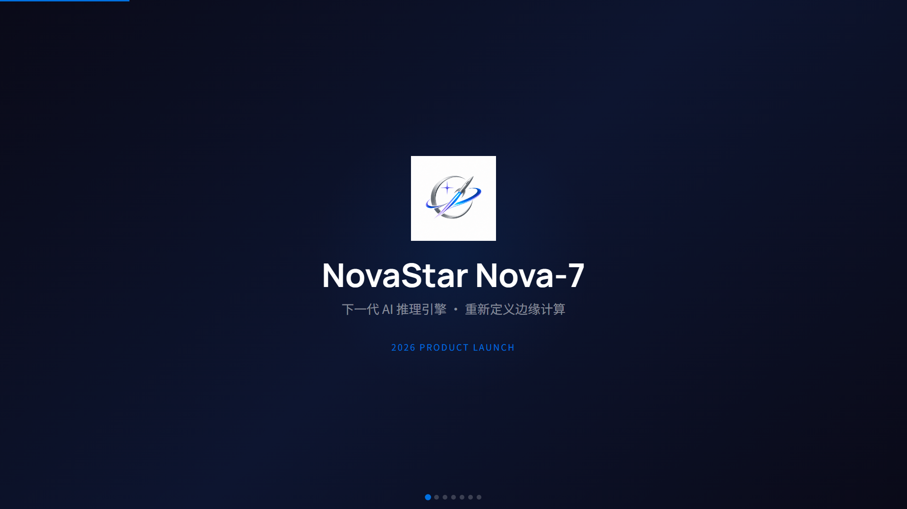
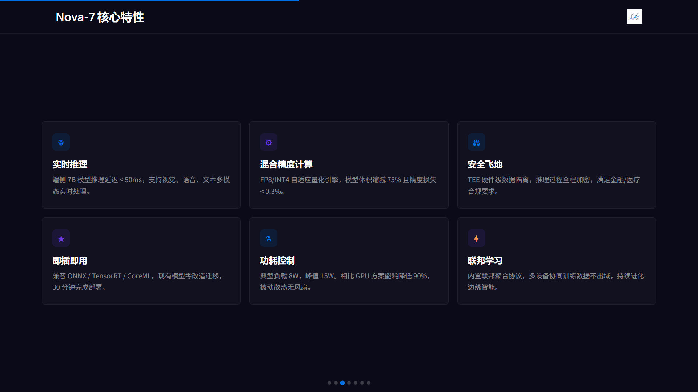
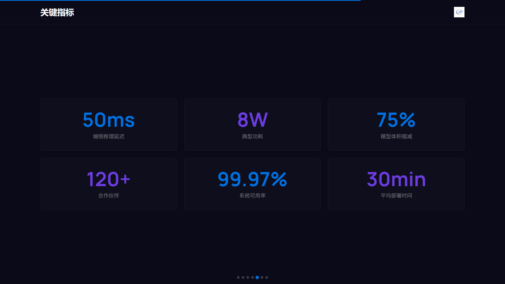
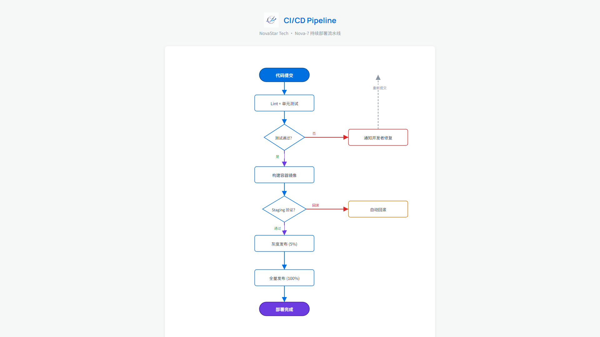

# logo2docs

**一个 LOGO，全套品牌文档。**

上传公司 LOGO，自动提取品牌色，生成完整设计系统，然后一键产出 Excel / Word / PPT / HTML 演示文稿 / PDF / 流程图 / 手册——风格统一，开箱即用。

> Claude Code 技能，作者 [曲直](https://github.com/quzhi-ai)

<p align="center">
  
</p>

---

## 工作原理

logo2docs 分两层：

1. **品牌建立**（一次性）— 从 LOGO 提取颜色 → 3 个快速问题 → 生成完整设计系统 `brand-config.json`（40+ 设计 token）
2. **文档生成**（按需）— 基于 brand-config.json 生成任意文档类型，品牌风格自动统一

```
上传 LOGO → 提取颜色 → 3 个问题 → brand-config.json → 任意文档类型
```

### 支持的文档类型

| 格式 | 技术 | 输出 |
|------|------|------|
| Excel 表格 | openpyxl | `.xlsx` |
| Word 文档 | python-docx | `.docx` |
| PowerPoint 演示 | python-pptx | `.pptx` |
| HTML 演示文稿 | 内联 HTML/CSS/JS | `.html` |
| PDF | HTML → 浏览器打印 | `.html` / `.pdf` |
| 流程图 / 架构图 | 内联 SVG | `.html` |
| 手册 / 指南 | A4 分页 HTML | `.html` / `.pdf` |

> **💡 生成的 PPT 完全可编辑** — 用 PowerPoint / WPS / Keynote 打开，随意修改文字、移动元素、增减页面。是真正的 `.pptx` 文件，不是图片。想要更酷炫的动效？选择 HTML 演示模式。

## 快速开始

### 安装技能

```bash
npx skills add https://github.com/quzhi-ai/logo2docs
```

或手动：克隆本仓库，将内容复制到 Claude Code 技能目录。

### 使用

直接告诉 Claude：

> "这是我们公司的 LOGO。帮我建立品牌系统，然后生成一份季度报告 Excel。"

Claude 会：
1. 分析 LOGO 颜色
2. 问 3 个问题（行业、风格偏好、现有品牌规范）
3. 生成 `brand-config.json` — 完整设计系统
4. 生成品牌风格统一的文档

### 从 2 个颜色生成什么

| 类别 | 生成内容 | 用途 |
|------|---------|------|
| 颜色变体 | 主色深/浅、辅助色深/浅 | 标题 vs 背景 vs 浅色底 |
| 文字颜色 | 正文、辅助、弱化、反色 | 对比度安全的文字组合 |
| 功能色 | 成功、警告、错误、信息 | 不冲突的状态指示 |
| 图表配色 | 5-7 色和谐序列 | 数据可视化一致性 |
| 背景集 | 页面、卡片、柔和 | 视觉层次 |
| 字体 | 标题、正文、等宽（web + office） | 跨格式字体统一 |
| 布局 token | 边距、间距、圆角、阴影 | 空间一致性 |
| CSS 变量 | 完整 `:root` 块 | HTML 即插即用 |

## 设计原则

### 反 AI 审美

生成的文档看起来像专业设计师的作品，而不是 AI 产出：

- 不用渐变背景（尤其蓝紫渐变）
- 不用 emoji 做装饰
- 不用圆角卡片 + 左侧色条
- 不用 3D 饼图或假 3D 效果
- 大量留白（40% 空白是好设计）
- 高对比度，精确网格对齐
- 纯色块，细线分隔

### 60-30-10 配色法则

- **60%** — 中性色（白色/浅色背景，正文）
- **30%** — 品牌主色（标题、重点区块）
- **10%** — 辅助色/强调（高亮、数据重点）

### WCAG 对比度

所有文字/背景组合均通过 WCAG AA 标准检查（最低 4.5:1 对比度）。

## 演示

`demos/` 目录包含 3 个完整品牌演示：

### ABC 教育（Bold 风格）
儿童教育机构 — 珊瑚红 + 青绿。Excel、Word、PPT、HTML 演示、流程图。

<p align="center">
 <br>
 <br>
 
</p>

### NovaStar Tech（Modern 风格）
AI / 边缘计算初创 — 电光蓝 + 紫色。HTML 演示、流程图。

<p align="center">
 <br>
 
</p>

### 朴叶堂（Elegant 风格）
高端养生茶品牌 — 橄榄绿 + 暖杏色。PPT、HTML 手册（8 页 A4）。

<p align="center">
 <br>
 
</p>

## 文件结构

```
logo2docs/
├── SKILL.md              # 技能定义（Claude 读取）
├── requirements.txt      # Python 依赖
├── scripts/
│   ├── brand_setup.py    # 颜色提取 + 配置生成
│   ├── brand_preview.py  # 设计系统 HTML 预览
│   └── brand_check.py    # 品牌合规检查器
├── references/
│   ├── brand-config-schema.md   # 配置 schema 文档
│   └── document-specs.md        # 各格式生成规范
├── evals/
│   └── evals.json        # 评估提示词
└── demos/
    ├── abc-education/     # Bold 风格演示
    ├── novastar-tech/     # Modern 风格演示
    └── puye-wellness/     # Elegant 风格演示
```

## 依赖

所有 Python 包在首次使用时自动安装：

```
Pillow          # LOGO 颜色提取
openpyxl        # Excel 生成
python-docx     # Word 生成
python-pptx     # PPT 生成
pypdf           # PDF 操作
pdfplumber      # PDF 读取
```

可选：[Playwright](https://playwright.dev/) 用于自动 HTML 转 PDF。没装也行，浏览器里 Ctrl+P 打印成 PDF 即可。

## 颜色科学

1. **提取**：LOGO 缩放至 150x150，16 阶量化，相似色聚类（距离 < 40），按频率排序
2. **扩展**：从 2 个基础色通过 HSL 明度调整生成深浅变体，查找 WCAG 安全文字色，色相旋转生成图表系列
3. **校验**：每组文字/背景对检查 WCAG AA 对比度（最低 4.5:1）

## 许可证

MIT — 见 [LICENSE](LICENSE)

## 作者

**曲直** (Justin Qu)

---

*[English README](README.md)*
